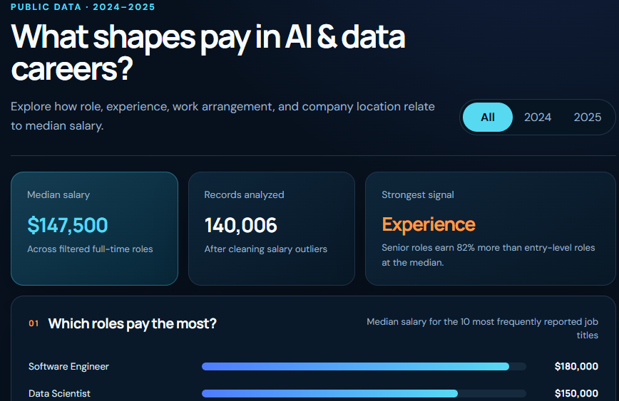

# AI & Data Careers Salary Dashboard

## Public Data Analysis and Interactive Visualization

This dashboard explores how job role, experience, work arrangement, and company location relate to median salaries in AI and data careers using public 2024–2025 data.

## Dashboard Preview

## Project Highlights

- Analyzed 140,006 salary records
- Compared frequently reported AI and data roles
- Examined salary differences by experience level
- Included work-arrangement and company-location comparisons
- Presented findings through a clear, interactive dashboard
- Identified experience as a strong salary indicator

## Skills Demonstrated

- Data analysis
- Data cleaning
- Salary trend analysis
- Dashboard design
- Data visualization
- Business insight development
- AI-assisted application development

## Project Status

Completed dashboard prototype.
