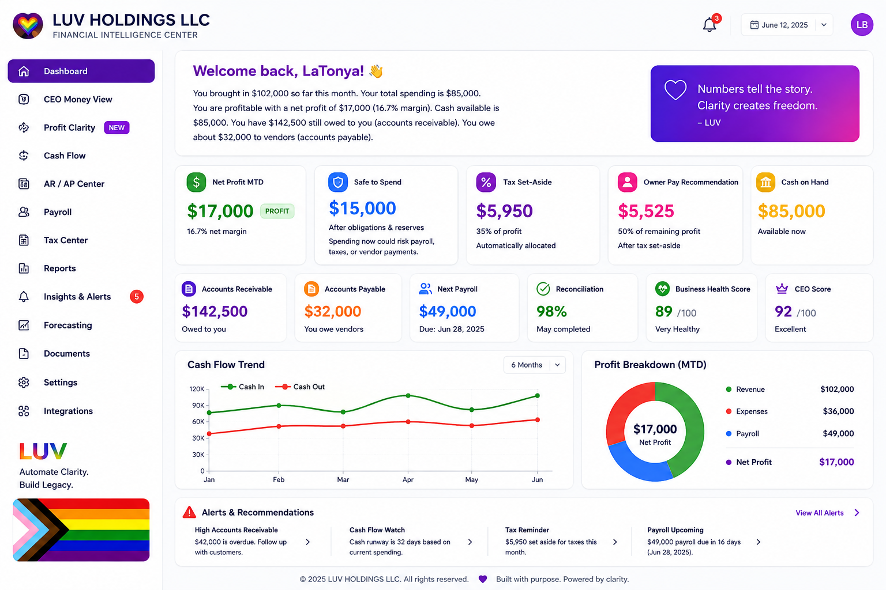

# IMS by LUV

## AI-Powered Financial Intelligence for Business Owners

IMS by LUV is a financial intelligence and accounting-support platform developed to help business owners understand their financial position without having to interpret complicated accounting reports.

**Live application:** [Visit IMS by LUV](https://ims-by-luv.net)

## Dashboard Preview

## The Business Problem

Many small-business owners can see revenue, expenses, and account balances but still struggle to answer essential questions:

* Is the business truly profitable?
* How much money is safe to spend?
* How much should be reserved for taxes?
* How much can the owner safely pay themselves?
* Are upcoming bills creating cash-flow pressure?
* Which accounts receivable require attention?

IMS by LUV translates financial data into plain-language insights and practical recommendations.

## My Role

I developed the business concept, financial logic, requirements, user experience, feature structure, pricing model, and integration strategy. I used AI-assisted application development to turn more than 23 years of accounting and financial-operations experience into a working financial technology platform.

## Core Features

* Financial Intelligence Center
* CEO Money View
* Advisor Dashboard
* Profit Clarity Dashboard
* Real-time profit insights
* Safe-to-spend calculations
* Automatic tax set-aside guidance
* Owner-pay recommendations
* Cash-flow warning system
* Accounts receivable and accounts payable alerts
* Business Health Score
* CEO Score
* Stability Index
* Tax Risk Index
* Cash Flow Stress Index
* Owner Sustainability Score
* Forecast modeling and trend history
* Grant-Ready Financial Snapshot
* Executive PDF reports
* CSV financial-data upload

## Financial Logic

The application converts accounting information into decision-support calculations.

Examples include:

* **After-tax profit:** Profit minus the recommended tax set-aside
* **Owner-pay recommendation:** 50% of profit remaining after the tax set-aside
* **Safe-to-spend analysis:** Available cash adjusted for expected receivables, upcoming payables, taxes, and operating needs
* **Cash-flow risk:** Evaluation of available cash compared with upcoming financial obligations

Key inputs include cash balance, accounts receivable expected within 14 days, accounts payable due within 14 days, profit, and estimated tax percentage.

## Integrations

* QuickBooks Online
* Intuit OAuth
* CSV financial-data uploads
* Stripe subscription payments
* Executive PDF reporting

Future integration plans include Xero, Wave, FreshBooks, Zoho Books, Sage 50cloud, NetSuite, Patriot, Expensify, and Kashoo.

## Subscription Model

* **Starter:** $69 per month or $690 per year
* **Pro:** $129 per month or $1,290 per year
* **Enterprise:** Contact sales
* Seven-day trial available for monthly Starter and Pro subscriptions
* Optional Monthly Close and Cleanup service

## Skills Demonstrated

* Financial systems analysis
* Accounting-process design
* Business requirements development
* AI-assisted application development
* Financial modeling
* Risk-scoring design
* Dashboard and user-experience planning
* QuickBooks Online integration
* OAuth workflow implementation
* Stripe subscription integration
* Product pricing and commercialization
* Executive financial reporting

## Business Impact

IMS by LUV helps business owners move beyond viewing numbers to understanding what those numbers mean. The platform supports better cash-flow planning, tax preparation, owner compensation, profitability analysis, and financial decision-making.

---

[Return to the main portfolio](../README.md)
