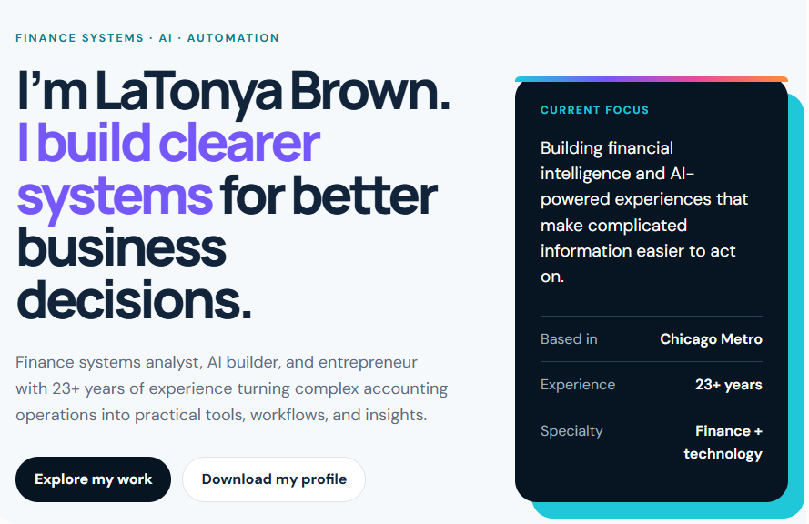

# LaTonya Brown Professional Portfolio

## Finance Systems, AI, and Automation

This professional portfolio showcases my experience combining more than 23 years of accounting and finance knowledge with AI, automation, data analysis, and financial systems.

## Portfolio Preview

## Professional Focus

- Financial systems and business analysis
- AI-powered financial tools
- Workflow and process automation
- Accounting operations and reporting
- Data analysis and visualization
- Practical technology for business decision-making

## Portfolio Goal

My goal is to build clear, practical technology that simplifies complex financial processes, improves decision-making, and helps organizations grow.

## Availability

Based in Downers Grove, Illinois. Available for remote, hybrid, contract, consulting, and project-based opportunities.
